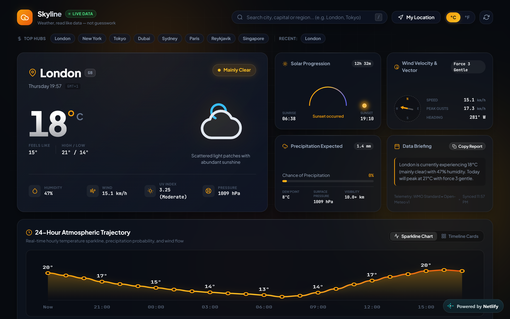
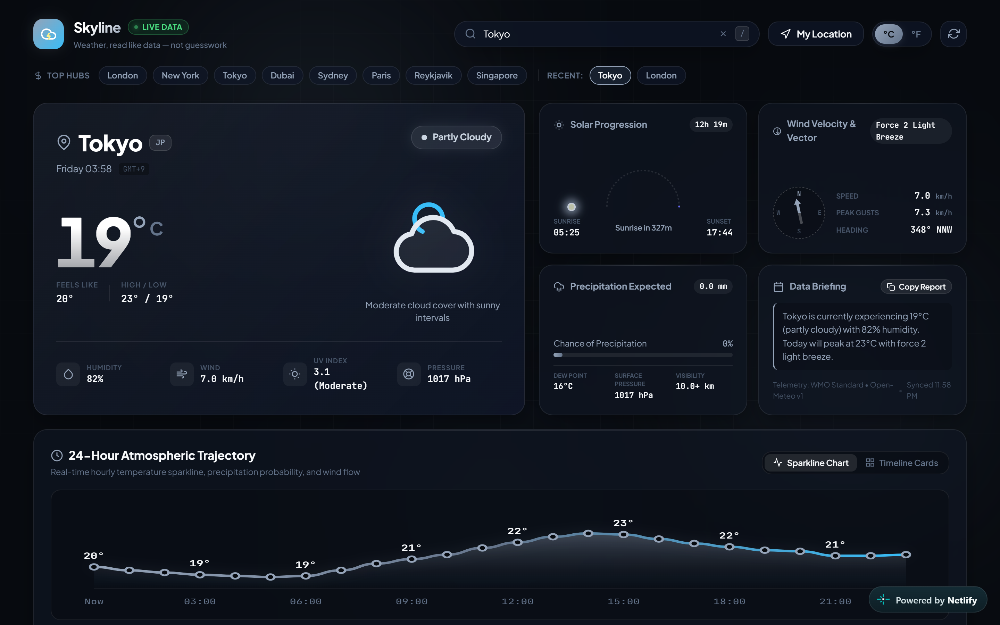
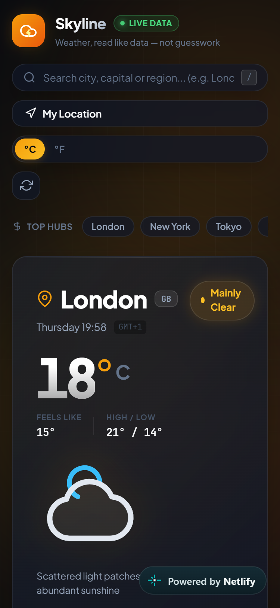

# Skyline — Real-Time Weather Intelligence Dashboard

> **Auspify Technologies Internship — Task 4 (Weather Dashboard Using API)**

A real-time weather dashboard for **Skyline**, built with live data from the [Open-Meteo](https://open-meteo.com) API (no API key required). Styled as a data-dense analytics dashboard rather than a typical cartoonish weather widget, with condition-adaptive ambient theming.

   

## Live Demo
[skyline-weather-dashboard.netlify.app](https://skyline-weather-dashboard.netlify.app)

## Features

- **Live weather data** via the Open-Meteo API — current conditions, 24-hour hourly forecast, and 7-day outlook
- **Geocoding search** with debounced city autocomplete suggestions
- **Browser Geolocation** ("Use my location") with reverse geocoding
- **Condition-adaptive theming** — the ambient background glow shifts based on current weather (warm for clear skies, deep blue for rain, violet for storms, icy cyan for snow)
- **Interactive SVG sparkline** for the 24-hour temperature trend, with hover tooltips
- **Animated sun arc** showing real sunrise/sunset position from the API
- **Wind compass** with a needle rotated to the actual wind direction
- **Skeleton loading states** while data is being fetched
- **Styled error handling** for invalid cities and network failures — no `alert()` popups
- **`localStorage`** for recent searches and unit (°C/°F) preference
- **Keyboard shortcuts** — `/` to search, `U` to toggle units, `L` for location, `R` to refresh
- Fully responsive, with a horizontally scrollable hourly strip on mobile

## Screenshots

### Desktop


### Key Feature


### Mobile


## API

- **Weather + Forecast:** [Open-Meteo](https://open-meteo.com) — free, no API key required
- **Reverse Geocoding:** [BigDataCloud](https://www.bigdatacloud.com/) — free, no API key required

No credentials or `.env` setup needed — the app works out of the box.

## Project Structure

```
Skyline/
├── index.html    # Semantic HTML5 markup
├── style.css     # Design system, condition-based theming, responsive layout
└── app.js        # API integration, geocoding, forecast rendering, UI logic
```

## Running Locally

No build step or dependencies required.

```bash
python -m http.server 3000
# or
npx serve .
```

Then open `http://localhost:3000` in your browser.

## Built With

- HTML5
- CSS3 (custom properties for dynamic theming, `backdrop-filter`)
- Vanilla JavaScript (`fetch`/`async-await`, Geolocation API, SVG rendering)
- [Open-Meteo](https://open-meteo.com) & [BigDataCloud](https://www.bigdatacloud.com/) APIs

---

**Part of a 4-project internship submission for Auspify Technologies.**
See also: [PulseTrack](https://github.com/fahadmusa725/pulsetrack-landing-page) · [Flowboard](https://github.com/fahadmusa725/flowboard-task-manager) · [Cadence](https://github.com/fahadmusa725/cadence-ecommerce-store)
